# Python script to draw in pixelpage.deno.dev

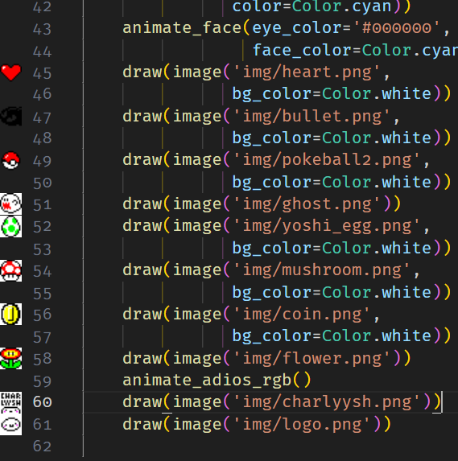
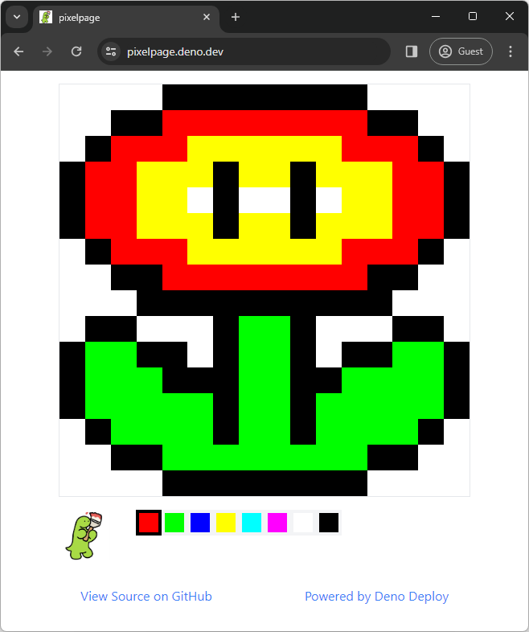

draw.py script sends requests to paint pixels in [pixelpage.deno.dev](https://pixelpage.deno.dev)

## How to draw

The tool used to draw is
https://es.pixilart.com/
 
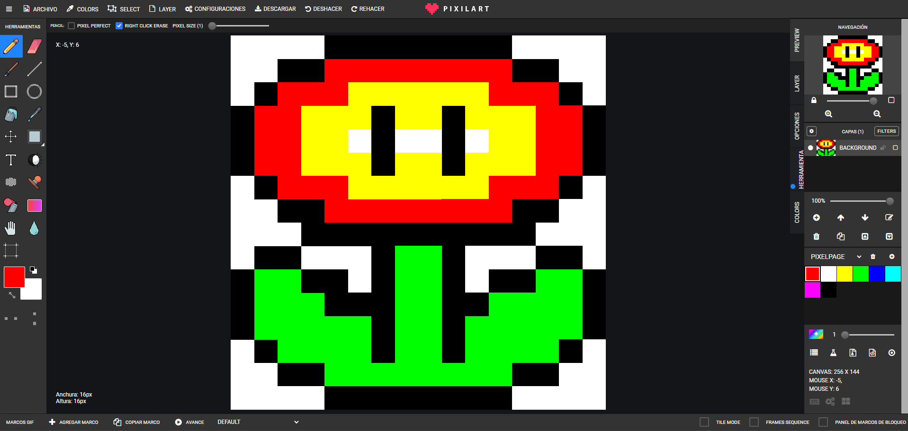

Before starting, we need to configure the tool.

### Import colors palette
First we need to import the colors supported by the pixelpage.
1. Create a new palette
 

    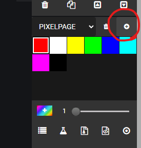
    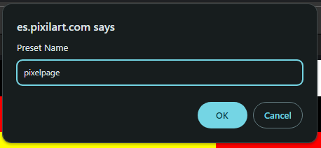

2. Import colors clicking on the next button and add the next colors  `ff0000,00ff00,0000ff,ffff00,00ffff,ff00ff,ffffff,000000`
 

    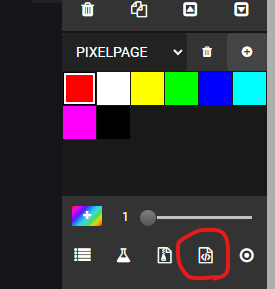
    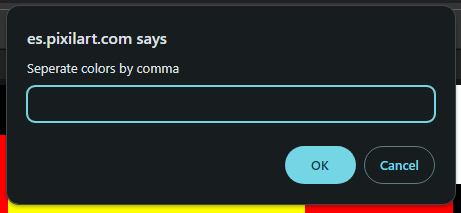

3. We're ready with the colors of the pixelpage
 

### Set canvas dimension
1. Edit canvas with the tool or from the bar options.
 

    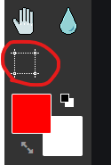
    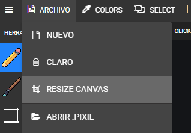

2. Set 16x16 and enable the checkmark if you already imported the image to resize it.
 
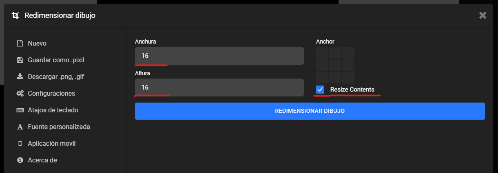

### Import image
In this example we will use the 
 
<a href="flower_example.jpg">
    flower_example.jpg
     
    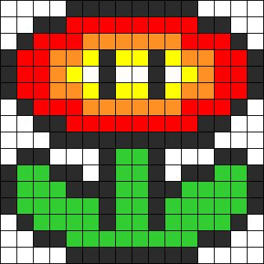
</a>

1. Import the 16x16 image.
if the image is not 16x16 it will be automatically resized.
 

    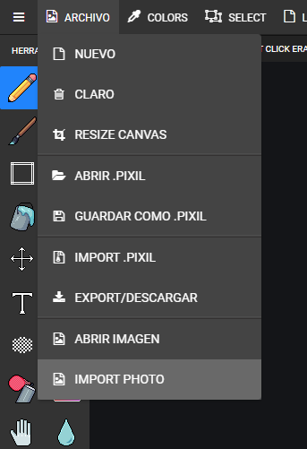
    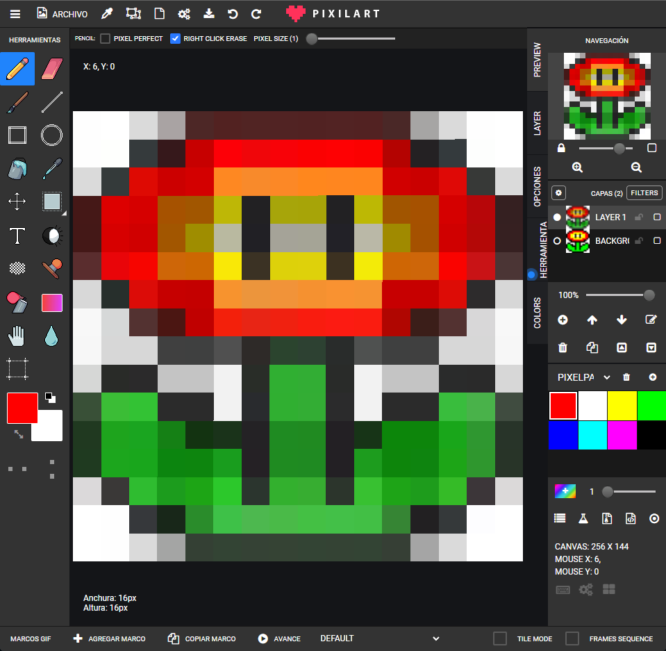

2. Apply the color palette to replace the colors with similar supported colors.
 

    
    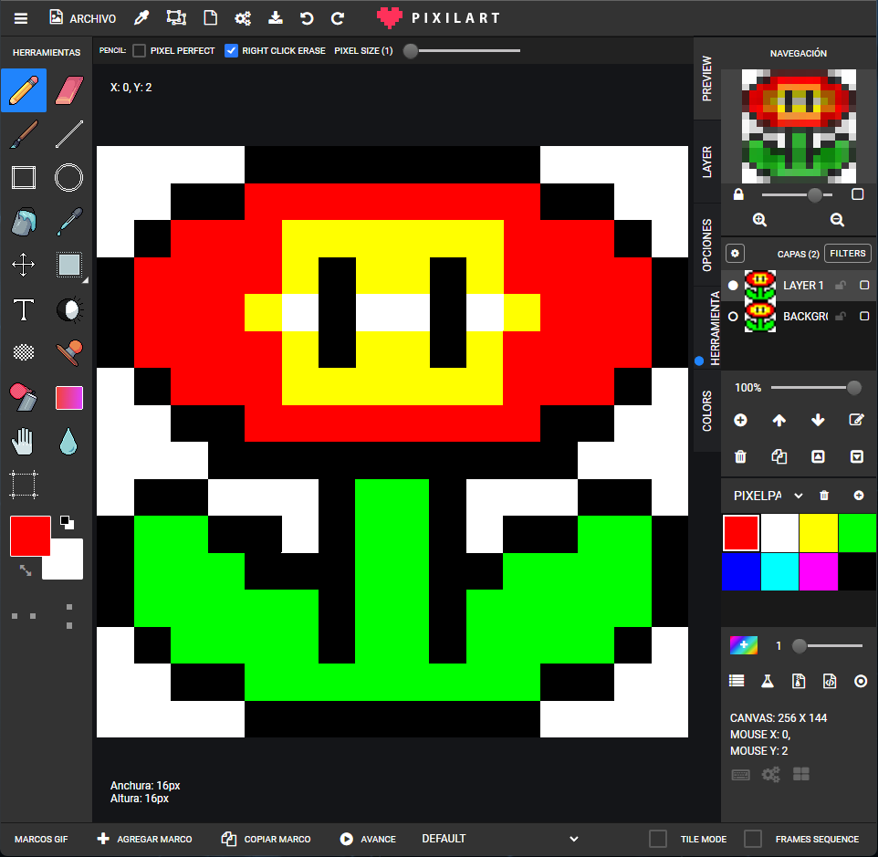

3. Verify and manually edit the pixels if required. In this case some yellow pixels were missing.
 
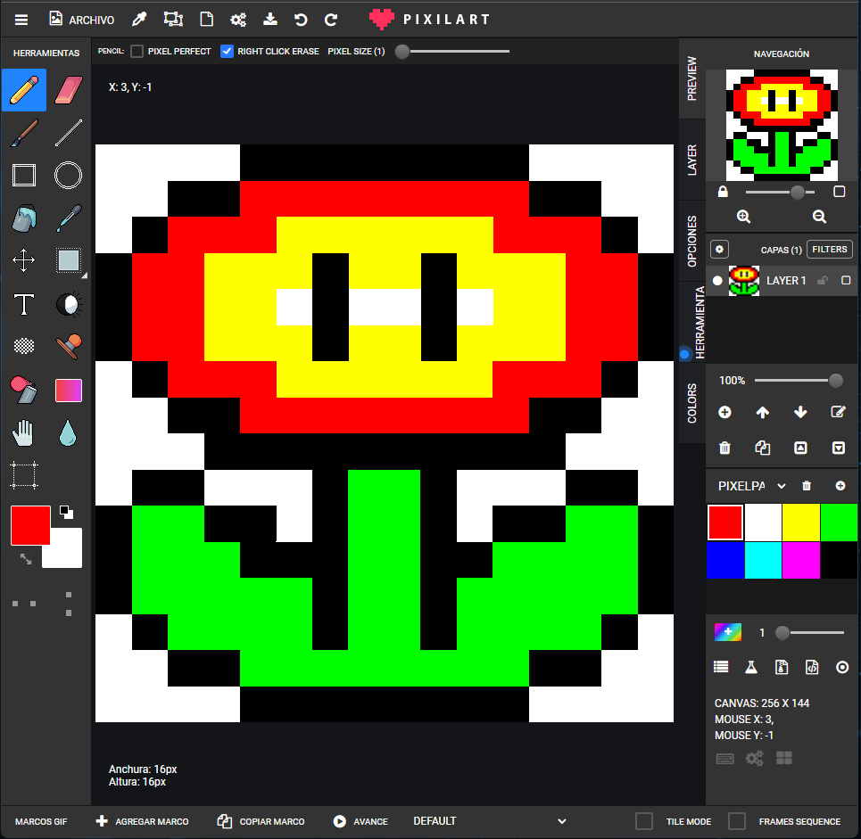

### Download the pixel art
When we are ready, click on the download option on the top bar and save the image as png.
 
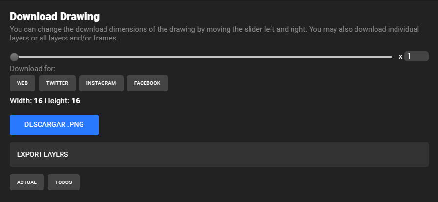
